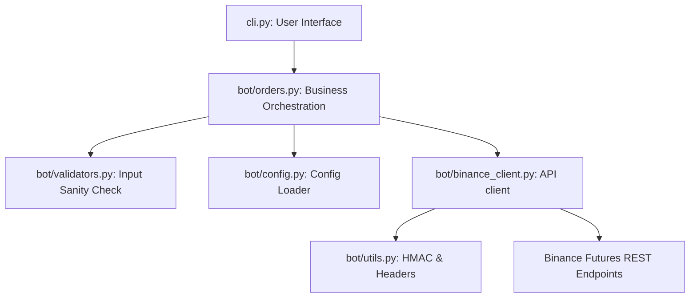

# Architecture Decision Records (ADR) & Design Document

This document outlines the core architectural patterns, design decisions, and engineering tradeoffs implemented in the **Binance Futures Trading Bot**.

---

## 🏛️ Clean Architecture Design

The bot is structured to strictly separate concerns, enforcing a clean boundary between the user interface, business rules, and external network resources:

This clean separation guarantees that:
* The user interface (CLI) can be swapped out (e.g., with a GUI, Web app, or API backend) without modifying the trading core.
* Network and API client configurations do not bleed into business logics.

---

## 🛠️ Key Architectural Decisions

### 1. Direct REST Client vs. Third-Party Wrappers (e.g., `python-binance`, `ccxt`)
* **Decision**: Implement direct HTTP requests and raw cryptographic signatures from scratch using `requests` and `hmac`.
* **Rationale**: 
  * Avoids heavy dependencies, keeping the application lightweight.
  * Demonstrates low-level understanding of the official Binance API specifications (specifically millisecond UNIX epoch timestamps and HMAC-SHA256 signature hashing).
  * Promotes security by minimizing supply-chain package risks in a financial application.

### 2. Fail-Fast Local Parameter Validation
* **Decision**: Check and sanitize all inputs locally (in `bot/validators.py`) before initiating connection sequences.
* **Rationale**:
  * Prevents wasting server requests on simple user mistakes (e.g., missing price on LIMIT orders, negative quantities).
  * Minimizes rate-limiting (Binance heavily penalizes repeatedly rejected API payloads).

### 3. Dry-Run (Simulation Mode)
* **Decision**: Add a `--dry-run` flag to the orchestrator layer (`bot/orders.py`).
* **Rationale**:
  * Allows developers to test CLI behavior and parameters locally without requiring real credentials, API keys, or live trading balances.
  * Simplifies offline unit testing and local continuous integration.

### 4. Exponential Backoff Retry Strategy
* **Decision**: Wrap the network request engine (`BinanceClient._send_signed_request`) with a manual exponential backoff retry loop (up to 3 attempts).
* **Rationale**:
  * Resolves temporary network socket drops or ISP connection dropouts smoothly.
  * Incorporates a sleep interval that doubles each time (`1.0s`, `2.0s`, `4.0s`) to avoid slamming the servers.

### 5. Separate Structured File Logging
* **Decision**: Route detailed request/response payloads, connection retries, and errors to `logs/bot.log` while keeping the console output pristine.
* **Rationale**:
  * Ensures that developers can debug issues asynchronously from log histories.
  * Guarantees a premium terminal user experience (UX) without cluttering it with long raw JSON response bodies.
